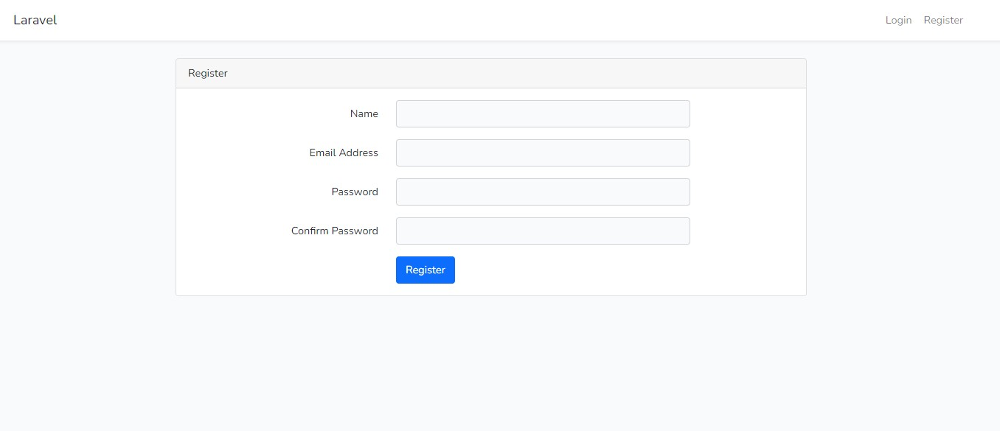

<h1 align="center">Tree Structure Manager</h1>

## General info ##
This is the solution of the test task involving the programming of the mechanism
tree structure management.<br>

The application was implemented using the following technologies:<br>
- MySql Ver 15.1 Distrib 10.4.22-MariaDB<br>
- PHP 8.1.2, Laravel Framework 9.17.0<br>
- HTML5, CSS3, Javascript, jQuery 3.3.1<br>

## Setup ##
1. Clone the repository to your computer by typing in terminal:<br>
```https://github.com/krzychu12350/tree-structure-manager```
2. Type in the terminal:<br>
```cd tree-structure-manager```
3. Create a MySql database with a name of your choice
4. Import the database from the 'tree_structure_manager.sql' file 
   located in the mysql_db_dump directory
5. Copy the file '.env.example' and rename it to '.env', then configure it<br>
   to allow application connect with database
6. Type in the following commands in the terminal:
- ```composer install```
- ```php artisan key:generate```
- ```npm install; npm run dev```
- ```php artisan migrate --seed```
- ```php artisan serve```
7. Type in ```http://127.0.0.1:8000``` in your web browser
## User names needed to run the application ##

• Administrator<br>
Email Address: ```admin@gmail.com```<br>
Password: ```Admin?password123```<br>

• User<br>
Email Address: ```user@gmail.com```<br>
Password: ```User?password123```<br>

## Screenshots ##

### Login view ###

#### Enter your email address and password to log in ####

### Register view ###

#### Enter your name, email address and password to register ####

### User dashboard view ###

#### Double-click a tree root or node to collapse or expand its children ####

### Admin dashboard adding view ###

#### Enter the name of the new node or leaf and select or click on the selected node or leaf to be the parent of the new node or leaf ####

### Admin dashboard editing view ###

#### Select the node or leaf you want to edit ####

### Admin dashboard deleting view ###

#### Select the node or leaf you want to delete ####
